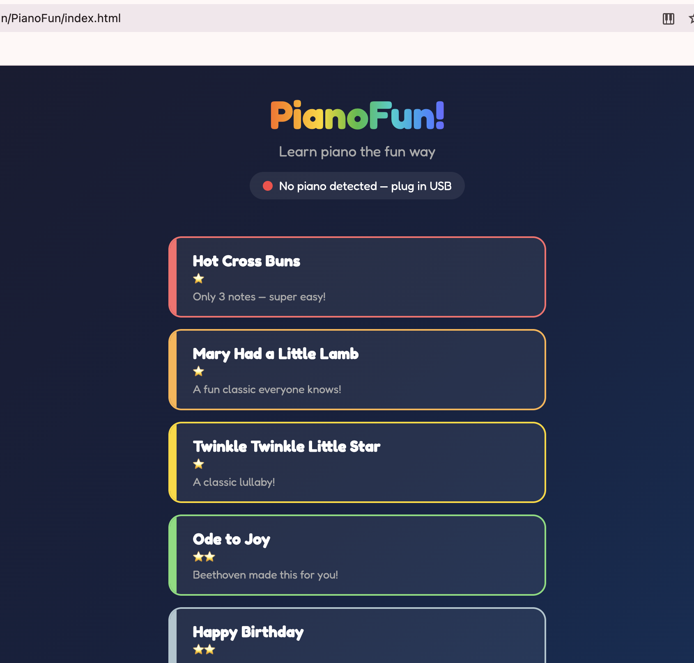
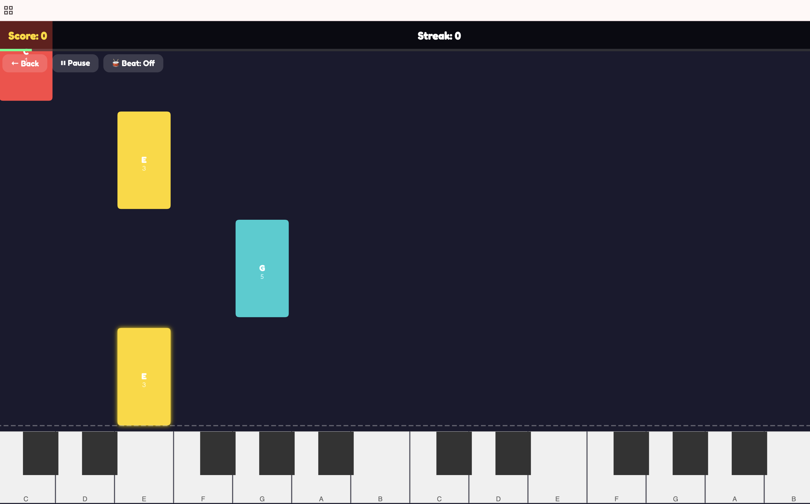

# PianoFun!

Learn piano the fun way — a browser-based piano learning game with MIDI keyboard support.

## Features

- MIDI keyboard connectivity
- Falling-note gameplay
- Built-in song library
- Score tracking with accuracy, streaks, and star ratings
- Beat/metronome toggle

## Getting Started

Open `index.html` in a modern browser. Connect a MIDI keyboard for the best experience.

## Author

**Victor Antofica** — [victorantos.com](https://victorantos.com)

## License

This project is licensed under the GNU General Public License v3.0 — see the [LICENSE](LICENSE) file for details.
